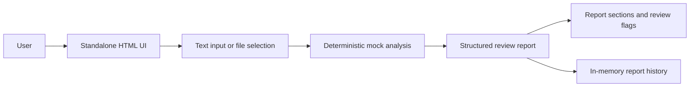
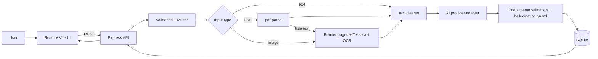

# Architecture

## Delivered preview architecture

The submitted preview is a single static HTML file. It runs entirely in the browser and uses synthetic, deterministic data. No clinical note or uploaded file is sent to an external service.

## Target production architecture from the build specification

The intended full-stack implementation is:

The production design separates the browser interface from extraction, AI calls, validation, persistence, and error handling. This prevents document processing and provider credentials from being exposed to the browser.
